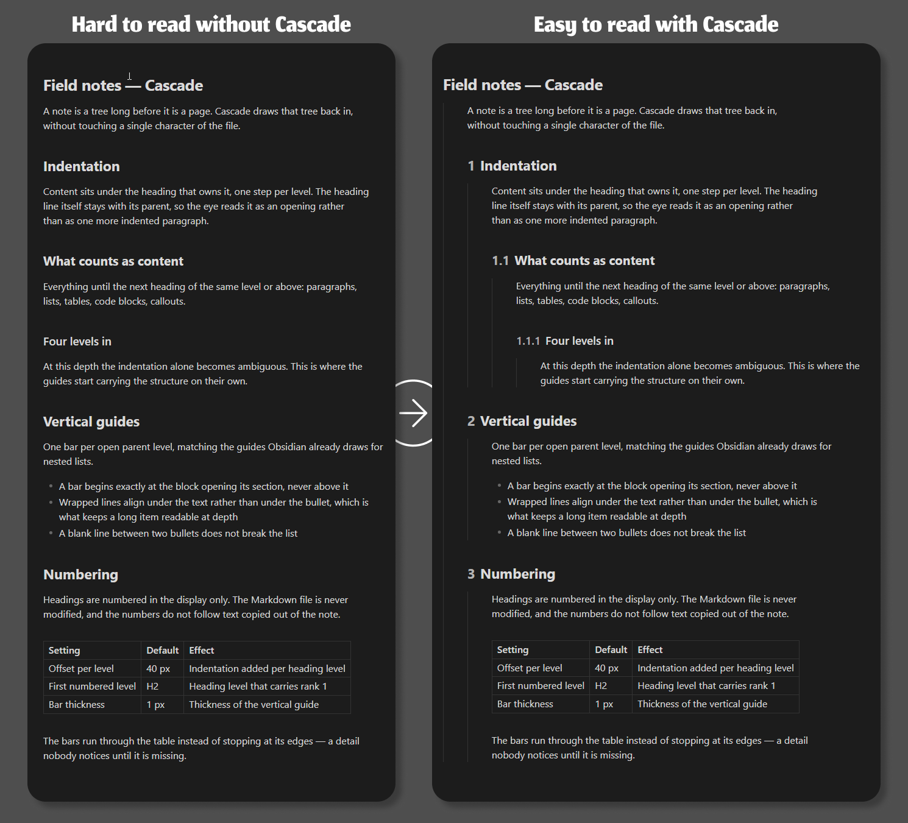

# Cascade

Indents content under each heading, draws a vertical guide per level, and numbers headings automatically — so a long note reads like the outline it already is.

Works in **Reading view** (including PDF export) and in **Editing view** (Live Preview and Source), each enabled and tuned independently.

## Features

Three functions, each of which can be turned on or off on its own:

- **Indentation** — content sitting under a heading is indented one step per heading level.
- **Vertical guides** — one bar per open parent level, matching the guides Obsidian already draws for nested lists.
- **Automatic numbering** — headings are numbered `1`, `1.1`, `1.1.1`, with a configurable starting level.

## How it works

Levels and numbers are read from the **Markdown source**, never inferred from the rendered DOM. Both views call the same `buildHeadingMap` function on the same text, so they cannot drift apart.

This is also what makes the result immune to virtualization, which both views use. Walking the DOM would lose the heading that serves as the anchor, and CSS counters would restart from zero while scrolling.

The JavaScript only sets `data-hib-*` attributes. All rendering lives in `styles.css`, so the look can be overridden from a theme or a CSS snippet.

Applied depth:

| Element | Depth |
| --- | --- |
| Heading line of level N | N−1 steps |
| Content under a heading of level N | N steps |
| Anything before the first heading | 0 |

## Settings

Each view — Reading and Editing — carries its own copy of these.

| Setting | Default | Effect |
| --- | --- | --- |
| Enable in this view | on / off | Reading is on out of the box, Editing is off |
| Offset per level | 40 px | Indentation added per heading level |
| Bar thickness | 1 px | Thickness of the vertical guide |
| Join between two blocks | auto | Height of the line connecting a block to the one before it |
| Join above a heading | auto | The same join, for the wider space that precedes a heading |
| Bar color | theme border | Any CSS color; empty follows light and dark mode |
| Number headings | on | Display only — Markdown files are never modified |
| First numbered level | H2 | Heading level that carries rank 1 |
| Space after the number | 8 px | Gap between the number and the heading text |

Editing view only, since Reading view already renders lists as blocks:

| Setting | Default | Effect |
| --- | --- | --- |
| List offset | auto | Bullet position |
| Space before a list | auto | Above the first bullet only |
| Bullet hanging indent | auto | How far the bullet sits back from its item text |

Reading view only, since Editing view already handles both cases:

| Setting | Default | Effect |
| --- | --- | --- |
| Space above the first heading | auto | The heading at the top of a note, which has no block before it |
| Space around a table | auto | Placed inside the block, so the bars run through it |

Empty means automatic: the value is derived from the active theme's own spacing variables.

## Languages

The interface follows the language set in Obsidian, falling back to English. Currently shipped: **English** and **French**.

Adding one means adding a block to `LOCALES` at the top of `main.js` — a flat map of the same keys as `en`, which is the reference. Missing keys fall back to English rather than showing blanks, so a partial translation is usable from the first key. Regional tags fall back to their base language (`zh-TW` uses `zh` if present).

## Installation

### Community plugins

Not yet listed. Once accepted: **Settings → Community plugins → Browse → Cascade**.

### BRAT

Install the *BRAT* plugin, then **Add beta plugin** with this repository. BRAT keeps it updated from GitHub releases.

### Manual

Download `main.js`, `manifest.json` and `styles.css` from the latest release into `<vault>/.obsidian/plugins/cascade/`, then reload Obsidian and enable the plugin.

## License

MIT — see [LICENSE](LICENSE).
